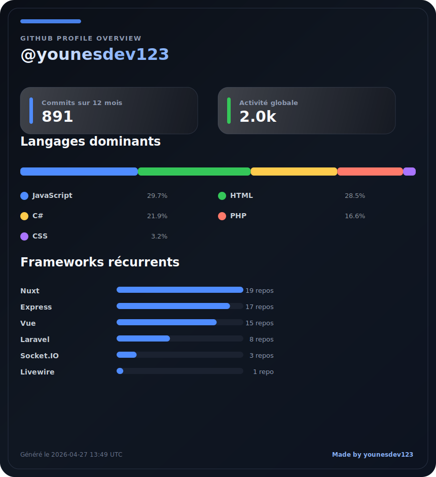

# 👋 Hello, moi c’est Younes

Développeur fullstack avec ~5 ans d’expérience.

J’ai principalement occupé des postes frontend, tout en développant en parallèle des projets backend (APIs, temps réel, automation).

---

## 🚀 Stack principale

### 🧠 Backend

- Node.js (Express)
- MongoDB (Mongoose)
- Redis (pub/sub)
- Socket.io (temps réel)
- JWT / Auth / rôles

### 🎨 Frontend

- Vue.js 2 & 3 (Options API & Composition API)
- Nuxt 2 & 3
- Vuetify / Bootstrap

### ☁️ Cloud & Auth

- AWS
- Amazon Cognito (authentification, gestion utilisateurs)

---

## 🧩 Autres technos & expériences

- C# (.NET, WinForms, WebSocket server, outils desktop)
- PHP (Laravel)
- API REST
- WebSocket (temps réel avancé)
- PM2 (cluster Node.js)
- Docker (création et gestion de containers)
- Linux (Ubuntu)
- Nginx / Apache2 (configuration serveur)
- MySQL (installation, configuration)
- Playwright (automatisation navigateur / scraping)
- Bots Discord (Node.js)
- Architecture scalable
- Automatisation / bots

---

## ⚡ Spécialités

- Temps réel (Socket.io, WebSocket)
- Automatisation (Playwright, bots)
- Scraping / collecte de données (usage encadré)
- Communication multi-services (Redis, sockets)
- Architectures orientées performance
- Systèmes distribués (bots + panel temps réel)

---

## 💡 Ce que je fais concrètement

- Développement d’APIs performantes et sécurisées
- Systèmes temps réel (communication multi-clients via Socket.io)
- Panels d’administration (Nuxt + WebSocket)
- Développement frontend avec Vue.js (Options API & Composition API) et Nuxt 2 / 3
- Communication backend ↔ frontend en temps réel
- Outils automatisés (bots, scraping, gestion de comptes)
- Automatisation de navigation et collecte de données (Playwright, dans le respect des contraintes des plateformes)
- Développement de bots (Discord, automatisation de tâches)
- Applications desktop connectées à des services web (C#)
- Déploiement et configuration serveur (Linux, Nginx, Docker)
- Gestion de données complexes (MongoDB)

---

## 🚀 Projets (exemples)

🔹 Bot temps réel & panel admin

- Backend Node.js + Socket.io
- Frontend Nuxt 3
- Communication temps réel multi-clients
- Auth JWT + rôles
- Redis (pub/sub)
- Déploiement avec PM2

🔹 Système automatisé distribué

- API Express + MongoDB
- Dashboard admin temps réel
- Communication inter-services
- Monitoring et traitement de données

🔹 Bots & automatisation

- Bots Discord (Node.js)
- Automatisation navigateur avec Playwright
- Scripts de collecte de données
- Gestion de tâches automatisées

👉 D’autres projets sont privés, je peux faire une démo ou détailler l’architecture sur demande.

---

## 🧪 Expérience

- ~5 ans en développement web & logiciel
- Fullstack (frontend + backend)
- 3+ ans en backend Node.js (projets personnels avancés)
- Expérience avec AWS (Cognito notamment)
- Développement de systèmes complets (API + frontend + outils clients)

---

## 🎯 Objectif

Construire des systèmes fiables, performants et propres, avec une vraie attention sur la qualité du code et la scalabilité.

---

## 📌 Important

La majorité de mes projets sont privés (projets clients et outils personnels).

👉 Je peux :

- présenter du code
- faire une démo technique
- détailler l’architecture

---

## 🐍 Contributions

---

## 📊 GitHub Stats

